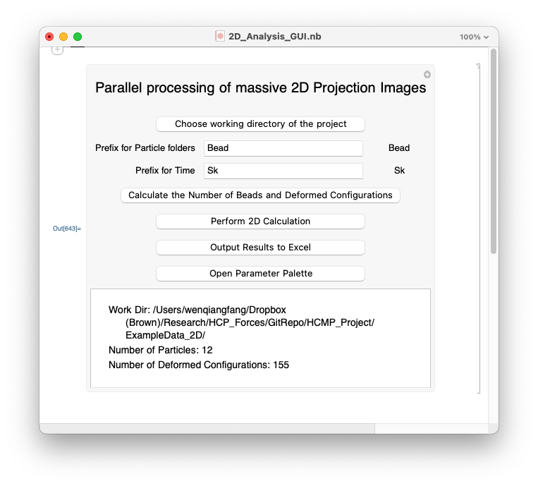

# HCMP Project GUIs

<!-- TABLE OF CONTENTS -->

  
Table of Contents

  <ol>
    <li>
      <a href="#screenshot">Screenshot</a>
    </li>
    <li>
      <a href="#getting-started">Getting Started</a>
      <ul>
        <li><a href="#download-and-install-wolfram-player">Download and Install Wolfram Player</a></li>
        <li><a href="#download-ao-desktop-app">Download AO-Desktop-App</a></li>
        <li><a href="#quick-demonstration">Quick Demonstration</a></li>
      </ul>
    </li>
    <li>
      <a href="#requirement-on-input-fields-and-data-files">Requirement on Input Fields and Data Files</a>
    </li>
    <li><a href="#license">License</a></li>
    <li><a href="#contact">Contact</a></li>
    <li><a href="#reference">Reference</a></li>
  </ol>

## Screenshot
This repository provide the **Graphic User Interfaces (GUIs)** for the **hyper-compliant microparticles (HCMPs)** Project.

In the `GUI` folder, we provide three Wolfram Computable Document Format (**CDF**) files
- __HCMP_GUI.cdf__ : the GUI for processing single particle deformation using 3D finite element analysis (FEA) and visualizing 3D shape/surface traction vector plot/surface normal traction histogram.
- __ParallelProcessing_GUI.cdf__: the GUI for processing massive data in parallel using 3D FEA.
- __2D_Analysis_GUI.cdf__: the GUI for processing massive data in parallel using spherically symmetric continuum mechanics approximation.

### HCMP_GUI

### ParallelProcessing_GUI

### 2D_Analysis_GUI

## Getting Started
It is easy to run the GUIs on your own by following the instructions:

### Download and Install Wolfram Player
In order to open the HCMP GUIs in the main file `HCMP_GUI.cdf`, `ParallelProcessing_GUI.cdf`, and `2D_Analysis_GUI.cdf`, you need to install [Wolfram Player](https://www.wolfram.com/player/) on your computer. [Wolfram Player](https://www.wolfram.com/player/) is a free software developed by [Wolfram Reserch](https://en.wikipedia.org/wiki/Wolfram_Research). The player is available for Microsoft Windows, Macintosh, Linux and iOS, and can be downloaded from the following website:

https://www.wolfram.com/player

Taking **MacOS** for example, after you open the downloaded `WolframPlayer_12.1.1_MAC_DLM` file, you should be able to see

After it is finished, you need to launch the installation package and it will show

When this is done, you can drag the Wolfram Player icon to the Applications folder to complete installation.

### Download the GUIs

On the top-right corner of this page, you will see a green button **⤓ Code**. Clicking on it, you will find the option to **Download ZIP** of the whole project.

You need to unzip the file. Inside the resulted folder, you will find the main file `HCMP_GUI.cdf`, `ParallelProcessing_GUI.cdf`, and `2D_Analysis_GUI.cdf` in folder `GUI`, open it with [Wolfram Player](https://www.wolfram.com/player/). Upon opening any of the files, you may see a pop-up window as shown in the following screenshot. Click on **Yes**.

After you have done all the above steps correctly, A user-interface will show up in the opened file as the screenshots shown in <a href="#screenshot">screenshot</a>.

### Quick Demonstration

#### HCMP_GUI.nb

__HCMP_GUI.nb__ works on one pair of HCMP configurations. It will plot the point cloud and fitting surface of both one non-deformed HCMP and one deformed HCMP. By using the linear theory of elasticity, the HCMP's stress field is determined through finite element analysis.
It will plot the traction vectors on the deformed configuration of the HCMP's surface. The normal component of the traction vector (normal traction component) at a large number of HCMP surface points are recorded. The distributions of the normal traction component data will be shown as colormap on the deformed configuration of the HCMP's surface as well as a histogram plot. Radius, volume, average pressures (one third the trace of the stress tensor), elastic energy density and total elastic energy stored within the HCMP
will be calculated.

#### ParallelProcessing_GUI.nb

__ParallelProcessing_GUI.nb__ works for processing massive data set. It performs all image processing and finite element calculations in parallel in one click. In order to use it, you need to put your images in a specific directory structure (please refer to `document/instruction.pdf`).

#### 2D_Analysis_GUI.nb

__2D_Analysis_GUI.nb__ works for processing massive 2D Projection image data set. It performs all image processing and 2D calculations in parallel in one click. In order to use it, you need to put your images in similar directory structure as in the above section.

## Requirement on Input Fields and Data Files

XXX

## Contact

For more info on how to use the GUIs or if you need specific features to be added to the GUIs, please email wenqiang_fang@brown.edu

## Publication
Gutierrez, Robert A., Wenqiang Fang, Haneesh Kesari, and Eric M. Darling. ["Force sensors for measuring microenvironmental forces during mesenchymal condensation."](https://www.sciencedirect.com/science/article/abs/pii/S0142961221000351?via%3Dihub) _Biomaterials_ 270 (2021): 120684.
